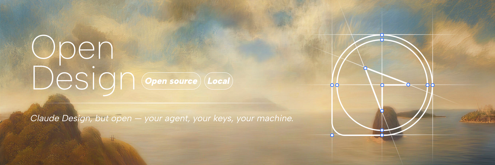

<h1 align="center">Open Design</h1>

<p align="center">
  
</p>


<p align="center">
  <a href="https://open-design.ai/"></a>
  <a href="https://github.com/nexu-io/open-design/releases"></a>
  <a href="LICENSE"></a>
  <a href="https://discord.gg/qhbcCH8Am4"></a>
  <a href="https://x.com/nexudotio"></a>
  <a href="QUICKSTART.md"></a>
</p>

<p align="center">
  <b>English</b> · <a href="docs/i18n/README.zh-CN.md">简体中文</a> ·
  <a href="docs/i18n/README.zh-TW.md">繁體中文</a> · <a href="docs/i18n/README.ja-JP.md">日本語</a> ·
  <a href="docs/i18n/README.ko.md">한국어</a> · <a href="docs/i18n/README.es.md">Español</a> ·
  <a href="docs/i18n/README.de.md">Deutsch</a> · <a href="docs/i18n/README.fr.md">Français</a> ·
  <a href="docs/i18n/README.pt-BR.md">Português</a> · <a href="docs/i18n/README.ru.md">Русский</a> ·
  <a href="docs/i18n/README.ar.md">العربية</a> · <a href="docs/i18n/README.tr.md">Türkçe</a> ·
  <a href="docs/i18n/README.uk.md">Українська</a>
</p>

<br/>

> **The open-source alternative to [Claude Design][cd].** Local-first, runs **16 Coding Agents** including OpenClaw, Claude Code, Hermes Agent — directly on your machine.
>
> **129 brand-grade design systems** — Linear / Stripe / Apple / Notion, swap with one click.
>
> **31 Skills** — Prototype / Live Artifact / Slides / Image / Video / Audio, end to end.

---

## 📋 What

✨ **Open Design (OD) is the open-source alternative to [Claude Design][cd] — an open-source workspace that turns natural language into shipped design artifacts.**

📝 Describe your design in one sentence, and OD produces deliverable prototypes, Live Artifacts, Slides, images, videos, and audio — 🎨 with the craft of a senior designer, not the sameness of generic AI output.

📤 Exports to HTML, PDF, PPT, ZIP, Markdown, and more.

🤖 Driven by **Coding Agents** (Claude Code / Codex / Cursor Agent / OpenClaw — your choice). 📂 Every Skill and Design System is a plain Markdown file in your project — read it, edit it, fork it, share it.

💻 **Local-first.** All data and runtime live entirely on your own machine.

## 💡 Why

🚀 In April 2026, Anthropic released [Claude Design][cd] and showed, **for the first time, that an LLM could actually do design** — not write essays *about* design, but **ship a real, usable design artifact**.

🔒 But it stayed **closed-source, paid, cloud-only**, and locked to Anthropic's models. Swapping the agent, self-hosting, BYOK — none of it was possible.

🔓 Open Design opens the same capability up: **pick the model, hold the keys, edit every Skill and Design System as a local file** — the entire system runs on your own hardware.

🤝 We're not building yet another Agent. The Claude Code, Codex, and Cursor Agent already on your laptop are good enough. **What OD does is wire them into a complete design workflow.**

## 🆚 Difference from other solutions

| | Claude Design | Figma | Lovable / v0 / Bolt | **Open Design** |
|---|---|---|---|---|
| **Open source** | ❌ | ❌ | ❌ | ✅ Apache-2.0 |
| **Local-first** | ❌ Cloud only | ❌ Cloud-bound | ❌ Cloud only | ✅ Daemon + desktop app |
| **Agent** | Anthropic only | Make-mode locked | Vendor-locked | ✅ 16 CLIs, your pick |
| **BYOK** | ❌ | ❌ | Partial | ✅ Anthropic / OpenAI / Azure / Google |
| **Brand systems** | Built-in, fixed | Team libraries (private) | Theme JSON | ✅ 129 Markdown systems, fully customizable |
| **Skill extension** | Closed source | Plugin marketplace (gated) | Closed source | ✅ Drop a folder, done |
| **Scenarios** | General design | UI / prototype / collab | Code-leaning prototypes | ✅ Design / marketing / ops / product / finance / HR |

## 🖼️ Demo

Four core artifact types:

### 📐 Prototype

<table>
<tr>
<td width="50%"><a href="https://github.com/nexu-io/open-design/tree/main/skills/gamified-app"></a><br/><sub><a href="https://github.com/nexu-io/open-design/tree/main/skills/gamified-app"><code>gamified-app</code></a> · Gamified mobile prototype — three-frame dark stage + XP bars + quest cards</sub></td>
<td width="50%"><a href="https://github.com/nexu-io/open-design/tree/main/skills/social-carousel"></a><br/><sub><a href="https://github.com/nexu-io/open-design/tree/main/skills/social-carousel"><code>social-carousel</code></a> · Social carousel — three 1080×1080 cards, headlines that connect</sub></td>
</tr>
</table>

### 🎞️ Slide

<table>
<tr>
<td width="50%"><br/><sub><b>Kami Deck</b> — "Designing intelligence on warm paper", magazine-style cover</sub></td>
<td width="50%"><br/><sub><b>Open Design Landing Deck</b> — landing-page-style presentation</sub></td>
</tr>
</table>

### 🖼️ Image

<table>
<tr>
<td width="50%"><a href="https://github.com/nexu-io/open-design/blob/main/prompt-templates/image/3d-stone-staircase-evolution-infographic.json"></a><br/><sub><b>3D Stone Staircase Evolution Infographic</b> — three-step infographic in hewn-stone aesthetic</sub></td>
<td width="50%"><a href="https://github.com/nexu-io/open-design/blob/main/prompt-templates/image/profile-avatar-glamorous-woman-in-black-portrait.json"></a><br/><sub><b>Glamorous Woman in Black Portrait</b> — editorial studio portrait</sub></td>
</tr>
</table>

### 🎬 Video

<table>
<tr>
<td width="50%"><a href="https://customer-qs6wnyfuv0gcybzj.cloudflarestream.com/7e8983364a95fe333f0f88bd1085a0e8/downloads/default.mp4"></a><br/><sub><b>Luxury Supercar Cinematic</b> — narrative product film, click to play MP4</sub></td>
<td width="50%"><a href="https://github.com/YouMind-OpenLab/awesome-seedance-2-prompts/releases/download/videos/1402.mp4"></a><br/><sub><b>Japanese Romance Short Film</b> — 15s Seedance 2.0 narrative</sub></td>
</tr>
</table>

## 🎯 Use cases

### 🎨 Designers

**Today:** Frame-by-frame work in Figma, repeatedly aligning the brand spec, then handing files to engineering. When the brand changes, every file syncs by hand.

**Pain:** Initial drafts take forever, brand swaps mean component-by-component edits, and design and engineering never share a single source of truth.

**OpenDesign:** Sketch the structure on the canvas instead of describing it in a prompt — the agent generates code-level prototypes from the sketch. Switching Design Systems automatically swaps palette, type, and spacing. Dual-track comments separate "note to self" from "instruction to agent". The final HTML is both the design and the engineering artifact.

---

### 📋 Product managers

**Today:** Write the PRD in Notion → wireframe in Figma → build the deck in Keynote → reconcile three documents by hand.

**Pain:** Three tools, perpetually out of sync. Showing a "live demo" to leadership means waiting on engineering.

**OpenDesign:** Generate a PM Spec doc (with TOC + decision log) from natural language; one sentence yields a magazine-style seed-round pitch deck; Live Artifact pulls real data from Notion / Linear, so a working product demo takes five minutes instead of a sprint.

---

### 💻 Engineers

**Today:** v0 / Bolt to start prototypes — but the model and key are locked in their cloud, and there's no way to fork your team's Skill into a private repo.

**Pain:** Data leaves the perimeter, token spend is unpredictable, extensions are gatekept by the platform, and the design-to-code handoff is human translation.

**OpenDesign:** BYOK against your own LLM gateway, every project on local SQLite. A Skill is just `SKILL.md` + `assets/` — drop the folder into `skills/`, done. "Handoff to Coding Agent" passes the design to Cursor / Claude Code with full context preserved.

---

### 📣 Marketing & ops

**Today:** Every campaign needs design bandwidth. Sizing for Xiaohongshu / WeChat / TikTok means manual cropping for every platform.

**Pain:** Waiting on design, every copy / color tweak is a re-do, and 50 cards a week is more than humans can sustain.

**OpenDesign:** One prompt yields six side-by-side social-card variants (Xiaohongshu cover / WeChat header / TikTok vertical, take your pick). Weekly reports / OKRs / kanban dashboards live on Live Artifact, wired to Notion / Linear / Slack — publish once, refresh forever.

## 🚀 Getting started

Three ways, pick the one that fits:

### 1️⃣ Download the desktop app (fastest, zero config)

The simplest path — install, open, and OD auto-detects every Coding Agent already on your `PATH`. Projects persist locally in SQLite.

- Desktop builds (macOS Apple Silicon · Windows x64): [open-design.ai](https://open-design.ai/)
- Past releases: [GitHub Releases](https://github.com/nexu-io/open-design/releases)

Best for: solo users, designers, PMs who want to click and start working.

### 2️⃣ Deploy to the cloud (team-shared)

Push the web layer to Vercel, share it across the team, and ship BYOK credentials via env vars. The daemon can still run locally or on your own server — clean front/back separation.

<p>
  <a href="https://vercel.com/new/clone?repository-url=https://github.com/nexu-io/open-design"></a>
  <a href="https://railway.app/new/template?template=https://github.com/nexu-io/open-design"></a>
  <a href="docs/deploy.md"></a>
</p>

Full deployment guide: [`docs/deploy.md`](docs/deploy.md)

Best for: small teams and startups that want a shared asset library + design system without running infra.

### 3️⃣ Self-host from source (full control)

Clone the repo and run the full stack — daemon + web + optional Electron shell — on your own machine:

```bash
git clone https://github.com/nexu-io/open-design
cd open-design
pnpm install
pnpm tools-dev start
# → http://localhost:3000
```

Full Quickstart: [`QUICKSTART.md`](QUICKSTART.md) · Architecture & options: [`docs/architecture.md`](docs/architecture.md)

Best for: developers and enterprises that need to fork, add custom Skills, or wire in an internal LLM gateway.

---

**Deeper docs**

| | |
|---|---|
| 📐 [Architecture](docs/architecture.md) | daemon · protocol parsing · BYOK proxy |
| 🧠 [Philosophy](docs/philosophy.md) | Junior-Designer mode · 5-dimensional self-critique · anti-AI-slop |
| 🤖 [Agents](docs/agents.md) | 16 CLIs in detail |
| 🎨 [Design Systems](docs/design-systems.md) | 129 systems out of the box |
| 🛠️ [Skills](docs/skills/) | the 31-Skill catalog |

## 🗺️ Roadmap

### ✅ Shipped

- **🏠 Home** — asset library (My Design / Templates / Brand Systems)
- **🎨 Studio** — four entrypoints (Prototype / Slides / Media / Import); Chat + File Manage + Sketch + sandboxed Preview; Editor with Tweaks · Comment · Present; HTML/PDF/PPT/ZIP/MD export
- **⚙️ Setting** — Execute Mode (Harness / BYOK), 14 Media Providers, Composio Connector, built-in Skills + MCP, Personalization

### 🟡 In progress

- **🎨 Studio** — Live Artifact (Beta); Editor's Edit · Draw · Voice editing
- **⚙️ Setting** — Memory (personal recall, cross-project reuse); Coding Plan

### 🚧 Planned

- **🎨 Studio** — Handoff to Coding Agent (the design→code last mile)
- **👭 Organization** — Workspace; team-level Skill & Memory; project-level 4-tier permissions (View / Comment / Edit / Private)

> Have priority feedback? Tell us on [Issues](https://github.com/nexu-io/open-design/issues) or [Discord](https://discord.gg/qhbcCH8Am4).

## 🤝 Contributing

We welcome every kind of contribution — new Skills, new Design Systems, bug fixes, translations.

- Fork & PR flow: [`CONTRIBUTING.md`](CONTRIBUTING.md)
- Add a Skill: drop a folder into [`skills/`](skills/) and restart the daemon — see [`docs/skills-protocol.md`](docs/skills-protocol.md)
- Add a Design System: write a `DESIGN.md` and put it under [`design-systems/`](design-systems/)
- Bug / feature requests: [GitHub Issues](https://github.com/nexu-io/open-design/issues)

## 💬 Community

- 💭 [Discord](https://discord.gg/qhbcCH8Am4) — daily discussion, Skill swaps, help threads
- 🐦 [@nexudotio](https://x.com/nexudotio) — product updates
- 🌟 If you like Open Design, drop a Star — it really helps.

## 👥 Contributors

Thanks to everyone moving Open Design forward — through code, docs, Skills, Design Systems, or a sharp Issue. The wall below is the most direct way to say *thank you*.

<a href="https://github.com/nexu-io/open-design/graphs/contributors">
  
</a>

<br/>

Shipping your first PR? Welcome. The [`good-first-issue` / `help-wanted`](https://github.com/nexu-io/open-design/issues?q=is%3Aissue+is%3Aopen+label%3A%22good+first+issue%22%2C%22help+wanted%22) labels are the entry point.


## 📊 GitHub Stats

<a href="https://repobeats.axiom.co"></a>

## ⭐ Star History

<a href="https://star-history.com/#nexu-io/open-design&Date">
  <picture>
    <source media="(prefers-color-scheme: dark)" srcset="https://api.star-history.com/svg?repos=nexu-io/open-design&type=Date&theme=dark" />
    <source media="(prefers-color-scheme: light)" srcset="https://api.star-history.com/svg?repos=nexu-io/open-design&type=Date" />
    
  </picture>
</a>

## 🙏 Built on

Open Design is one leg of an open-source relay. It runs because of the work that came before — these authors' projects directly form the foundation of OD:

<table>
<tr>
<td width="25%" align="center" valign="top">
  <a href="https://www.anthropic.com/"></a><br/>
  <a href="https://www.anthropic.com/"><b>Anthropic</b></a><br/>
  <sub><a href="https://www.anthropic.com/news/claude-design">Claude Design</a></sub><br/>
  <sub>The closed-source product this repo provides an open alternative to — origin of the artifact-first mental model.</sub>
</td>
<td width="25%" align="center" valign="top">
  <a href="https://github.com/alchaincyf"></a><br/>
  <a href="https://github.com/alchaincyf"><b>@alchaincyf</b> (Hua Shu)</a><br/>
  <sub><a href="https://github.com/alchaincyf/huashu-design"><code>huashu-design</code></a></sub><br/>
  <sub>The design-philosophy core — Junior-Designer workflow, 5-step brand-asset protocol, anti-AI-slop checklist, 5-dimensional self-critique.</sub>
</td>
<td width="25%" align="center" valign="top">
  <a href="https://github.com/op7418"></a><br/>
  <a href="https://github.com/op7418"><b>@op7418</b> (Guizang)</a><br/>
  <sub><a href="https://github.com/op7418/guizang-ppt-skill"><code>guizang-ppt-skill</code></a></sub><br/>
  <sub>Magazine-web-PPT skill bundled verbatim, the default Deck-mode implementation, source of the P0/P1/P2 checklist culture.</sub>
</td>
<td width="25%" align="center" valign="top">
  <a href="https://github.com/multica-ai"></a><br/>
  <a href="https://github.com/multica-ai"><b>@multica-ai</b></a><br/>
  <sub><a href="https://github.com/multica-ai/multica"><code>multica</code></a></sub><br/>
  <sub>Daemon + adapter architecture, PATH-scan agent detection, agent-as-teammate worldview.</sub>
</td>
</tr>
<tr>
<td width="25%" align="center" valign="top">
  <a href="https://github.com/OpenCoworkAI"></a><br/>
  <a href="https://github.com/OpenCoworkAI"><b>@OpenCoworkAI</b></a><br/>
  <sub><a href="https://github.com/OpenCoworkAI/open-codesign"><code>open-codesign</code></a></sub><br/>
  <sub>The first open-source Claude Design alternative — streaming-artifact loop, sandboxed iframe preview, live agent panel.</sub>
</td>
<td width="25%" align="center" valign="top">
  <a href="https://github.com/VoltAgent"></a><br/>
  <a href="https://github.com/VoltAgent"><b>@VoltAgent</b></a><br/>
  <sub><a href="https://github.com/VoltAgent/awesome-design-md"><code>awesome-design-md</code></a></sub><br/>
  <sub>Source of the 9-section <code>DESIGN.md</code> schema and the import path for 69 product systems.</sub>
</td>
<td width="25%" align="center" valign="top">
  <a href="https://github.com/farion1231"></a><br/>
  <a href="https://github.com/farion1231"><b>@farion1231</b></a><br/>
  <sub><a href="https://github.com/farion1231/cc-switch"><code>cc-switch</code></a></sub><br/>
  <sub>Symlink-based skill distribution across multiple agent CLIs — inspiration and reference implementation.</sub>
</td>
<td width="25%" align="center" valign="top">
  <a href="https://github.com/anthropics"></a><br/>
  <a href="https://github.com/anthropics"><b>@anthropics</b></a><br/>
  <sub><a href="https://docs.anthropic.com/en/docs/claude-code/skills">Claude Code Skills</a></sub><br/>
  <sub><code>SKILL.md</code> convention adopted as-is — any Claude Code skill drops into <code>skills/</code> and works.</sub>
</td>
</tr>
</table>

Every idea, every borrowed line of code, has a real author behind it. If you like Open Design, please go give them a Star ⭐ too.

## 📄 License

[Apache-2.0](LICENSE)

When Anthropic, OpenAI, and Google lock the most advanced AI design capability behind paywalls, the world still needs another voice — **bringing the frontier of technology back to every developer, designer, and creator's desk**.

We hope that one day an independent designer will no longer have to worry about subscription fees, and a student still in school will be able to use the best tools to make the first piece of work they're truly proud of.

> **Take it. Build with it. Make it yours.**

[cd]: https://www.anthropic.com/news/claude-design
