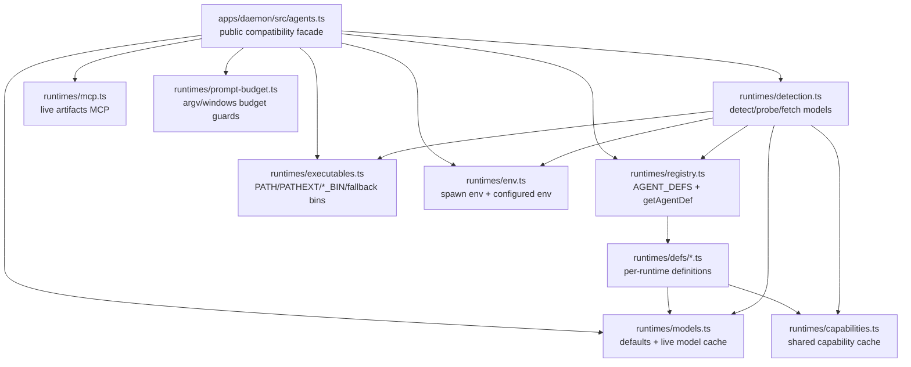

## Overview

### 目标

- 根据 specs/change/20260509-agents-ts-split/agents-merge-conflict-report.md 中的思路拆分 agents.ts 和 agents.test.ts，同时实现其中的三个阶段
- 在拆分的时候，保持 agents.ts 名字不变，但是新增的目录名使用 runtimes，后续逐步把 agents 的概念改名到 runtimes。
- 由于缺少测试保障，拆分重构的时候尽量以代码搬迁为主，不过逻辑重写。如果有确实需要逻辑重写的地方，先不处理，降低整体改动风险。

## Research

### Existing System

- `apps/daemon/src/agents.ts` 当前是 daemon agent adapter 的 public facade 和实现集合，导出 `AGENT_DEFS`、agent detection、binary resolution、MCP helper、prompt budget helpers、spawn env、model validation helpers。Source: `apps/daemon/src/agents.ts:157,970-983,1094-1111,1132-1433`
- `AGENT_DEFS` 是一个线性数组，当前包含 Claude、Codex、Devin、Gemini、OpenCode、Hermes、Kimi、Cursor Agent、Qwen、Qoder、Copilot、Pi、Kiro、Kilo、Vibe、DeepSeek 等 adapter definition。Source: `apps/daemon/src/agents.ts:157-812`
- agent definition 内嵌 adapter-specific CLI 协议、model fallback、reasoning options、stream format、fallback binary、MCP discovery、env knobs。Source: `apps/daemon/src/agents.ts:157-260,420-467,549-760,812-899`
- executable resolution 共享 `AGENT_BIN_ENV_KEYS`、PATH/toolchain directory discovery、configured binary override、fallback binaries、Windows PATHEXT handling。Source: `apps/daemon/src/agents.ts:91-109,900-983`
- detection flow 复用 executable resolution、agent env、version probing、help capability probing、model fetching，并刷新 live model cache。Source: `apps/daemon/src/agents.ts:985-1105,1394-1419`
- MCP live artifacts 目前由 `buildLiveArtifactsMcpServersForAgent` 根据 `def.mcpDiscovery === 'mature-acp'` 生成 `od mcp live-artifacts` server 配置。Source: `apps/daemon/src/agents.ts:1111-1121`
- prompt budget helper 覆盖 argv-bound adapter 的 raw prompt byte budget、Windows `.cmd/.bat` shim command line budget、Windows direct `.exe` command line budget。Source: `apps/daemon/src/agents.ts:1123-1330`
- spawn env helper 合并 configured env，展开 `~`，并针对 Claude Code 的 `ANTHROPIC_API_KEY`/`ANTHROPIC_BASE_URL` 策略做 case-insensitive 处理。Source: `apps/daemon/src/agents.ts:1342-1392`
- `apps/daemon/tests/agents.test.ts` 通过 `../src/agents.js` 导入 facade 导出，集中测试 registry、per-agent args、MCP、executable resolution、env、prompt budget。Source: `apps/daemon/tests/agents.test.ts:12-21,134-220,315-379,1060-1369,1812-2109`
- 测试文件顶部集中维护 agent fixtures、env snapshots、`globalThis.fetch` snapshot、`process.platform` descriptor 和 `afterEach` restore。Source: `apps/daemon/tests/agents.test.ts:24-124`
- 其他 daemon 模块从 `./agents.js` / `../src/agents.js` 直接使用 facade：server 使用 MCP helper 和 spawn env，connection test 使用 spawn env，chat-route test 使用 `getAgentDef`。Source: `apps/daemon/src/server.ts:22-32,5298,5576`; `apps/daemon/src/connectionTest.ts:26-27,1009`; `apps/daemon/tests/chat-route.test.ts:25`
- repository guidance 仍把 CLI/agent argument changes 指向 `apps/daemon/src/agents.ts` 和 matching parser tests；app tests 应保留在 `apps/<app>/tests/`。Source: `apps/AGENTS.md:12-24`

### Available Approaches

- **Pure migration with facade**: 保留 `apps/daemon/src/agents.ts` 作为旧 import 的 facade，内部拆到 `apps/daemon/src/agents/`，第一阶段让现有 tests 继续从 `../src/agents.js` 读取。Source: `specs/change/20260509-agents-ts-split/agents-merge-conflict-report.md:160-175,227-249`
- **Domain module split**: 将 executable resolver、env、MCP、prompt budget、registry、models 和 per-adapter defs 拆成独立模块，目标结构已在报告中列出。Source: `specs/change/20260509-agents-ts-split/agents-merge-conflict-report.md:177-206`
- **Test split by responsibility**: 将单个 `agents.test.ts` 拆为 defs、per-adapter args、executables、env、MCP、prompt-budget 测试文件，并提取 env restore 和 tmp executable fixture helper。Source: `specs/change/20260509-agents-ts-split/agents-merge-conflict-report.md:208-266`
- **Registry stabilization**: 后续让 `defs/index.ts` 按 agent id 排序导出，`registry.ts` 聚合数组并做 id uniqueness 约束。Source: `specs/change/20260509-agents-ts-split/agents-merge-conflict-report.md:268-277`
- **No facade migration**: 直接改调用方 imports 的可行面较小，因为 `server.ts`、`connectionTest.ts`、`chat-route.test.ts` 和现有 agent tests 都依赖 `agents.js` facade。Source: `apps/daemon/src/server.ts:22-32`; `apps/daemon/src/connectionTest.ts:26-27`; `apps/daemon/tests/chat-route.test.ts:25`; `apps/daemon/tests/agents.test.ts:12-21`

### Constraints & Dependencies

- Zest spec 要求保持 `agents.ts` 名字，新增目录名使用 `runtimes`，并以后逐步把 agents 概念改名到 runtimes。Source: `specs/change/20260509-agents-ts-split/spec.md:12-14`
- 当前 source 使用 `.js` import specifier，拆分 TypeScript 文件时需保持 ESM import 后缀约定。Source: `apps/daemon/src/agents.ts:12-13`; `specs/change/20260509-agents-ts-split/agents-merge-conflict-report.md:292-293`
- `agentCapabilities` 是 module-level cache，`buildArgs` 会读取检测阶段写入的 capability flags。Source: `apps/daemon/src/agents.ts:29-35,198-217,1043-1061`
- executable resolver 有 module-level `cachedToolchainDirs`/toolchain path behavior，测试覆盖 OD_AGENT_HOME、NPM_CONFIG_PREFIX、VP_HOME、PATHEXT、fallbackBins、configured `*_BIN` overrides。Source: `apps/daemon/src/agents.ts:900-983`; `apps/daemon/tests/agents.test.ts:1060-1361,1858-2004`
- `fetchModels`/`probe` 存在 intentional fallback 行为：model listing、version/help probing failure 会保留 fallback models 或可用状态。Source: `apps/daemon/src/agents.ts:985-1069`
- tests 修改应留在 `apps/daemon/tests/`，`src/` 保持 source-only。Source: `apps/AGENTS.md:14-24`
- 验证命令应使用 daemon-scoped checks：`pnpm --filter @open-design/daemon typecheck` 和 `pnpm --filter @open-design/daemon test`。Source: `apps/AGENTS.md:39-46`; `specs/change/20260509-agents-ts-split/agents-merge-conflict-report.md:244-249,262-266`
- 报告列出的主要风险是 module initialization order、circular dependencies、ESM suffix、test isolation、export compatibility。Source: `specs/change/20260509-agents-ts-split/agents-merge-conflict-report.md:278-299`

### Key References

- `specs/change/20260509-agents-ts-split/agents-merge-conflict-report.md:10-28` - merge conflict counts and registry conflict pattern.
- `specs/change/20260509-agents-ts-split/agents-merge-conflict-report.md:41-80` - executable/env conflict surfaces.
- `specs/change/20260509-agents-ts-split/agents-merge-conflict-report.md:82-123` - MCP, argv/stdin tests, fixture conflict surfaces.
- `specs/change/20260509-agents-ts-split/agents-merge-conflict-report.md:158-277` - proposed staged split.
- `apps/daemon/src/agents.ts:157-1433` - current implementation surface.
- `apps/daemon/tests/agents.test.ts:1-2109` - current concentrated test surface.

## Design

### Architecture Overview

### Change Scope

- Area: `apps/daemon/src/agents.ts` becomes a thin public facade that re-exports the existing API surface, keeping current imports from `./agents.js` and `../src/agents.js` stable. Impact: internal file movement without caller migration in this change. Source: `apps/daemon/src/server.ts:22-32,5298,5576`; `apps/daemon/src/connectionTest.ts:26-27,1009`; `apps/daemon/tests/chat-route.test.ts:25`; `apps/daemon/tests/agents.test.ts:12-21`
- Area: new `apps/daemon/src/runtimes/` modules own the moved implementation. Impact: the new directory name follows the spec's runtimes naming direction while preserving the old facade name. Source: `specs/change/20260509-agents-ts-split/spec.md:12-14`
- Area: adapter definitions move from the monolithic `AGENT_DEFS` array to per-runtime definition files under `runtimes/defs/`. Impact: merge conflicts shrink to individual runtime files while registry behavior stays centralized. Source: `apps/daemon/src/agents.ts:157-812`; `specs/change/20260509-agents-ts-split/agents-merge-conflict-report.md:10-28,177-206`
- Area: tests move from one concentrated `agents.test.ts` into responsibility-based files under `apps/daemon/tests/runtimes/` plus shared helpers. Impact: test ownership stays in daemon tests and source remains source-only. Source: `apps/daemon/tests/agents.test.ts:1-2109`; `apps/AGENTS.md:14-24`
- Area: no database, API contract, generated artifact, or rollout migration surface. Impact: validation is daemon typecheck and daemon tests. Source: `apps/AGENTS.md:39-46`; `specs/change/20260509-agents-ts-split/agents-merge-conflict-report.md:244-266`

### Design Decisions

- Decision: keep `apps/daemon/src/agents.ts` as the only compatibility facade and move implementation to `apps/daemon/src/runtimes/`. Source: `specs/change/20260509-agents-ts-split/spec.md:12-14`; `specs/change/20260509-agents-ts-split/agents-merge-conflict-report.md:160-206`
- Decision: preserve current public export names from the facade, including registry, detection, executable resolution, MCP, prompt budget, env, and model helpers. Source: `apps/daemon/src/agents.ts:970-983,1094-1111,1132-1433`; `apps/daemon/tests/agents.test.ts:12-21`
- Decision: keep phase 1 and phase 2 as code movement and test movement, with no behavioral rewrites or runtime-order changes. Source: `specs/change/20260509-agents-ts-split/spec.md:12-14`; `specs/change/20260509-agents-ts-split/agents-merge-conflict-report.md:160-175,208-266`
- Decision: keep `AGENT_DEFS` aggregation centralized in `runtimes/registry.ts`, importing individual `runtimes/defs/*.ts` definitions in the existing order. Source: `apps/daemon/src/agents.ts:157-812`; `specs/change/20260509-agents-ts-split/agents-merge-conflict-report.md:268-277`
- Decision: isolate singleton mutable state in dedicated helper modules: `capabilities.ts` for `agentCapabilities`, `executables.ts` for toolchain directory cache, and `models.ts` for live model cache. Source: `apps/daemon/src/agents.ts:29-35,900-983,1394-1433`
- Decision: enforce dependency direction from facade to domain modules, registry to defs, detection to helpers, and helpers away from the facade/registry unless explicitly required. Source: `specs/change/20260509-agents-ts-split/agents-merge-conflict-report.md:278-299`
- Decision: preserve ESM `.js` import specifiers in every new TypeScript import. Source: `apps/daemon/src/agents.ts:12-13`; `specs/change/20260509-agents-ts-split/spec.md:43-50`
- Decision: split tests by behavior while continuing to import through `../../src/agents.js` where compatibility is the behavior under test. Source: `apps/daemon/tests/agents.test.ts:12-21`; `apps/daemon/tests/agents.test.ts:134-220,315-379,1060-1369,1812-2109`

### Why this design

- It reduces merge conflicts at the adapter-definition and test-responsibility seams identified in the report while keeping the public facade stable.
- It follows the runtimes naming direction immediately, so later terminology migration does not start with a newly created `src/agents/` implementation tree.
- It minimizes behavior risk by moving stateful helpers as single modules instead of duplicating or rewriting them.
- It keeps compatibility tests pointed at the facade, so missing exports and accidental caller breakage fail early.

### Test Strategy

- Registry and facade: verify exported definitions, ids, lookup behavior, and current compatibility imports through `../../src/agents.js`. Source: `apps/daemon/tests/agents.test.ts:12-21,134-220`
- Adapter args: split argv/stdin/acp/runtime argument assertions into focused files while preserving existing fixtures. Source: `apps/daemon/tests/agents.test.ts:315-379`; `specs/change/20260509-agents-ts-split/agents-merge-conflict-report.md:208-266`
- Executables: preserve coverage for configured `*_BIN`, PATH lookup, fallback binaries, toolchain dirs, OD_AGENT_HOME, NPM_CONFIG_PREFIX, VP_HOME, Windows PATHEXT, and missing executable cases. Source: `apps/daemon/src/agents.ts:900-983`; `apps/daemon/tests/agents.test.ts:1060-1361,1858-2004`
- Env: preserve configured env merge, `~` expansion, and Claude Code API key/base URL case-insensitive handling. Source: `apps/daemon/src/agents.ts:1342-1392`
- Detection and models: preserve probing, help capability flags, fetch model fallback behavior, and live model cache updates. Source: `apps/daemon/src/agents.ts:985-1105,1394-1419`
- MCP and prompt budget: preserve mature ACP MCP live artifacts behavior and argv/Windows command-line budget checks. Source: `apps/daemon/src/agents.ts:1111-1330`
- Validation: run `pnpm --filter @open-design/daemon typecheck` and `pnpm --filter @open-design/daemon test` after each implementation step. Source: `apps/AGENTS.md:39-46`; `specs/change/20260509-agents-ts-split/agents-merge-conflict-report.md:244-266`

### Pseudocode

Flow:
  1. Create `runtimes/` helper modules for models, capabilities, invocation, paths, executables, env, MCP, prompt budget, detection, registry, and definitions.
  2. Move unchanged code blocks from `agents.ts` into the matching modules.
  3. Update imports with `.js` suffixes and keep singleton state in one owning module.
  4. Replace `agents.ts` contents with facade exports matching the previous public API.
  5. Split `agents.test.ts` into focused `apps/daemon/tests/runtimes/*.test.ts` files and shared helpers.
  6. Run daemon typecheck/tests, then address only movement-related failures.

### File Structure

- `apps/daemon/src/agents.ts` - stable public facade re-exporting existing daemon runtime helpers.
- `apps/daemon/src/runtimes/types.ts` - shared runtime definition and helper types moved from the monolith.
- `apps/daemon/src/runtimes/models.ts` - default model option, model validation helpers, live model cache.
- `apps/daemon/src/runtimes/capabilities.ts` - shared capability cache used by detection and runtime args.
- `apps/daemon/src/runtimes/invocation.ts` - process invocation wrapper around `execAgentFile`.
- `apps/daemon/src/runtimes/paths.ts` - home expansion and path utilities.
- `apps/daemon/src/runtimes/executables.ts` - executable resolution, PATH scanning, PATHEXT, fallback bins, toolchain dirs.
- `apps/daemon/src/runtimes/env.ts` - `spawnEnvForAgent` and configured environment handling.
- `apps/daemon/src/runtimes/mcp.ts` - live artifacts MCP server construction.
- `apps/daemon/src/runtimes/prompt-budget.ts` - prompt argv and Windows command-line budget checks.
- `apps/daemon/src/runtimes/detection.ts` - runtime detection, probing, help capability discovery, model fetching.
- `apps/daemon/src/runtimes/resolution.ts` - `resolveAgentBin` glue from registry to executable resolver.
- `apps/daemon/src/runtimes/registry.ts` - `AGENT_DEFS`, `getAgentDef`, id uniqueness guard.
- `apps/daemon/src/runtimes/defs/*.ts` - per-runtime definitions moved from the current `AGENT_DEFS` array.
- `apps/daemon/tests/runtimes/*.test.ts` - split daemon runtime tests by responsibility.
- `apps/daemon/tests/runtimes/helpers/*.ts` - shared env, fetch, platform, executable fixture helpers extracted from the current monolith.

### Interfaces / APIs

- `apps/daemon/src/agents.ts` continues to export the current public API used by daemon callers and tests.
- New `runtimes/*` modules are internal daemon implementation modules; external app/package imports should continue through `agents.ts` unless a future spec promotes a dedicated contract.
- Test helpers remain under `apps/daemon/tests/runtimes/helpers/` and are not imported by app source.

### Edge Cases

- Preserve current `AGENT_DEFS` order during the initial split so UI order and existing assertions stay stable.
- Move caches, do not duplicate them, for `agentCapabilities`, toolchain dirs, and live models.
- Keep intentional fallback behavior for failed version/help/model probing.
- Keep Windows-specific PATHEXT and command-line budget paths covered after module movement.
- Keep env restoration, `globalThis.fetch` restoration, and `process.platform` descriptor restoration shared across split tests.

## Plan

- [x] Step 1: Establish runtime module skeleton and facade
  - [x] Substep 1.1 Implement: create `apps/daemon/src/runtimes/` modules and move shared types/constants/helpers without behavior changes.
  - [x] Substep 1.2 Implement: replace `apps/daemon/src/agents.ts` with compatibility exports for the existing API surface.
  - [x] Substep 1.3 Verify: run daemon typecheck and the split runtime tests against the facade.
- [x] Step 2: Split runtime definitions and registry
  - [x] Substep 2.1 Implement: move each `AGENT_DEFS` entry into `runtimes/defs/*.ts` while preserving order.
  - [x] Substep 2.2 Implement: centralize aggregation and lookup in `runtimes/registry.ts` with an id uniqueness guard.
  - [x] Substep 2.3 Verify: run registry, args, detection, and daemon typecheck coverage.
- [x] Step 3: Split tests by responsibility
  - [x] Substep 3.1 Implement: extract shared env/fetch/platform/tmp executable helpers under `apps/daemon/tests/runtimes/helpers/`.
  - [x] Substep 3.2 Implement: split `agents.test.ts` into registry, args, executables, env, detection, MCP, and prompt-budget test files.
  - [x] Substep 3.3 Verify: run `pnpm --filter @open-design/daemon test` and ensure split tests still import compatibility APIs through the facade where relevant.
- [x] Step 4: Stabilize edge cases and review boundaries
  - [x] Substep 4.1 Implement: fix movement-only circular imports, `.js` import suffixes, and singleton ownership issues found by validation.
  - [x] Substep 4.2 Verify: run `pnpm --filter @open-design/daemon typecheck` and `pnpm --filter @open-design/daemon test`.
  - [x] Substep 4.3 Verify: review changed files against app test placement and facade compatibility boundaries.

## Notes

<!-- Optional sections — add what's relevant. -->

### Implementation

- Split `apps/daemon/src/agents.ts` into a thin facade over `apps/daemon/src/runtimes/*` modules.
- Moved adapter definitions into `apps/daemon/src/runtimes/defs/*.ts` and preserved registry order in `apps/daemon/src/runtimes/registry.ts`.
- Kept singleton ownership in dedicated modules: capabilities cache, executable toolchain-dir cache, and live model cache.
- Split daemon agent tests into `apps/daemon/tests/runtimes/*.test.ts` with shared helpers under `apps/daemon/tests/runtimes/helpers/`.
- Fixed configured-env `~` expansion after review and added split-test coverage for home-path expansion.

### Verification

- `pnpm --filter @open-design/daemon typecheck` ✅
- `pnpm --filter @open-design/daemon exec vitest run -c vitest.config.ts tests/runtimes` ✅
- `pnpm --filter @open-design/daemon exec vitest run -c vitest.config.ts tests/chat-route.test.ts` ✅ after one full-suite flaky failure in `tests/chat-route.test.ts`.
- `pnpm --filter @open-design/daemon test` ⚠️ runtime split tests passed; full suite still fails in existing unrelated `tests/finalize-design.test.ts` assertions where resolved artifact names include long relative temp paths.
